# EasyEDA-Tools by Peter Yuen
## 1 Change Font

Changes all text in current tab to the target font.

**Before**: Verdana font.

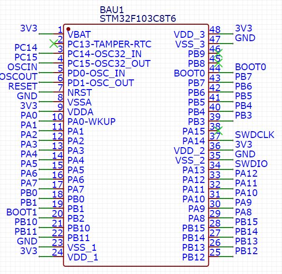

**Select "Change Font" from menu**

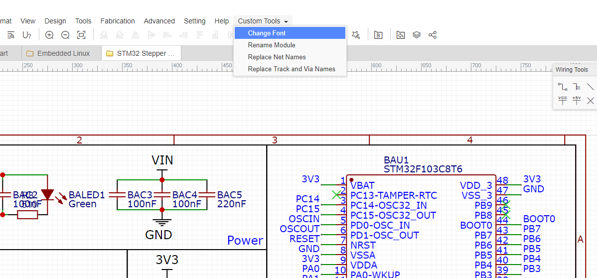

**Font Options**: change `FONTS` in `main.js` to add more valid fonts.

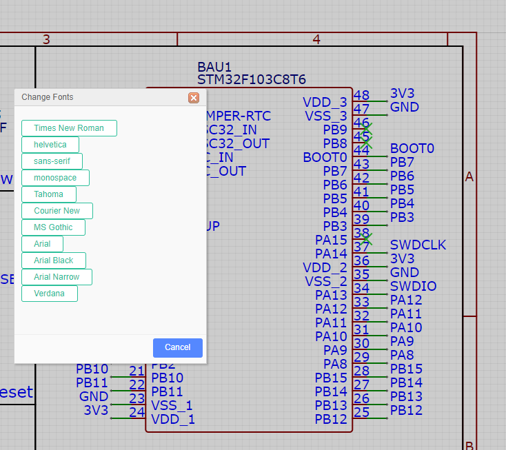

**After**: Times New Roman font.

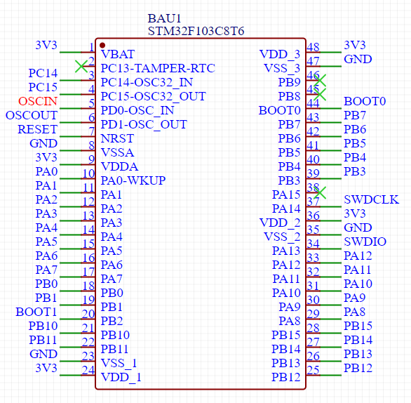

## 2 Reusable Schematic and PCB Modules (Rename Module + Replace Net Names)

Currently, EasyEDA supports schematic and PCB modules but not hierarchical modules. This makes net naming and multiple instantiation of the same schematic module very difficult (as net names are all global).

This tools library allow schematic and PCB modules to be reused easily. The following example implements multiple TMC2208 drivers:

**Step 1**: Create schematic and PCB, naming global nets with a `_G` suffix.

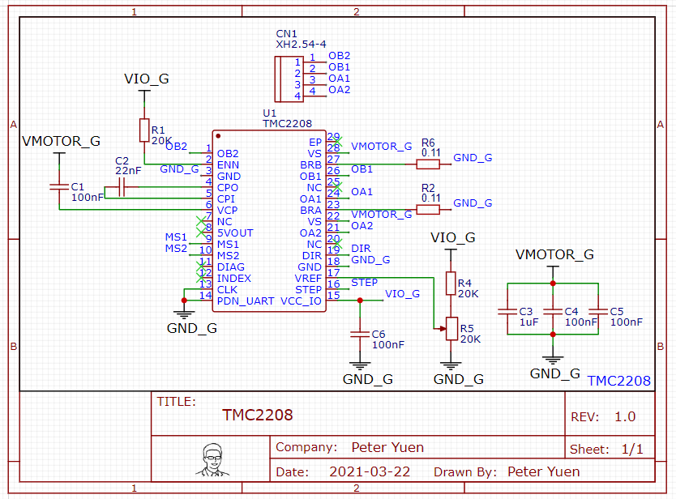

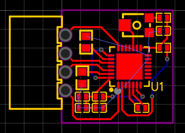

**Step 2**: Save both schematic and PCB as module.

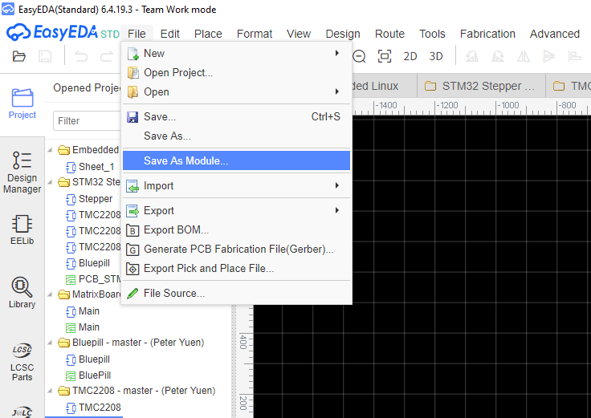

**Step 3**: Open new sheet in desired project (where modules are to be reused) and insert schematic module (`shift+F` => `SCH Module`).

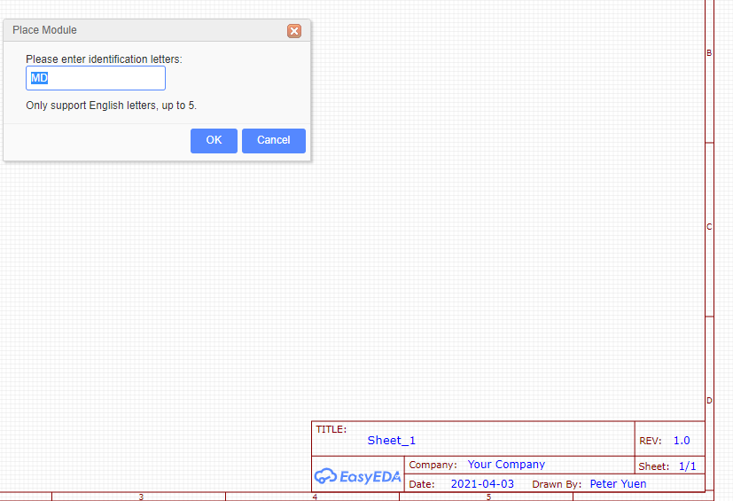
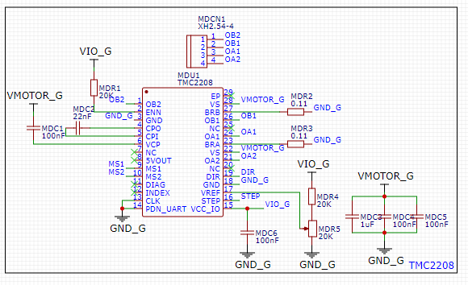

**Step 4**: Rename nets in schematic using any (as long as it is unique) prefix.

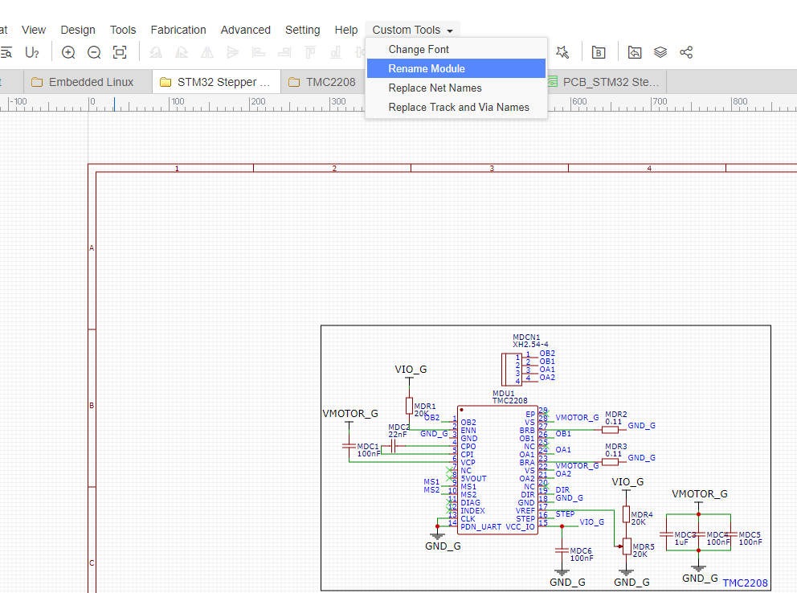
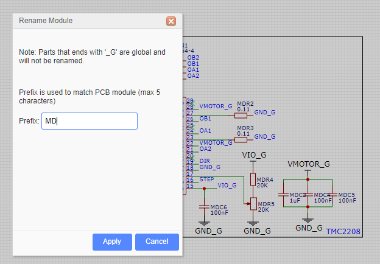
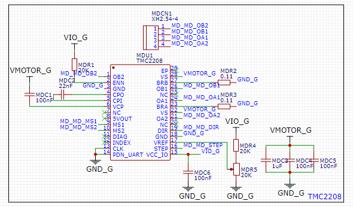

**Step 5**: Insert PCB module (`shift+F` => `PCB Module`) using same prefix (`MD` in this example).

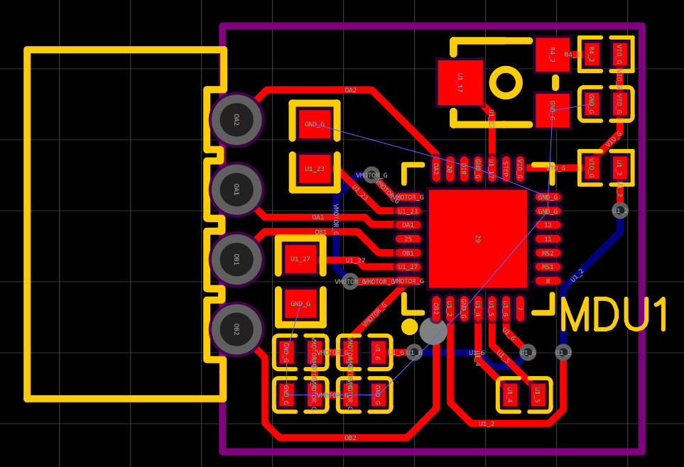

**Step 6**: Go back to schematic page and select `Update PCB` (skip Net checks). **REMEMBER TO CHECK THE TRACK UPDATE CHECKBOX**.

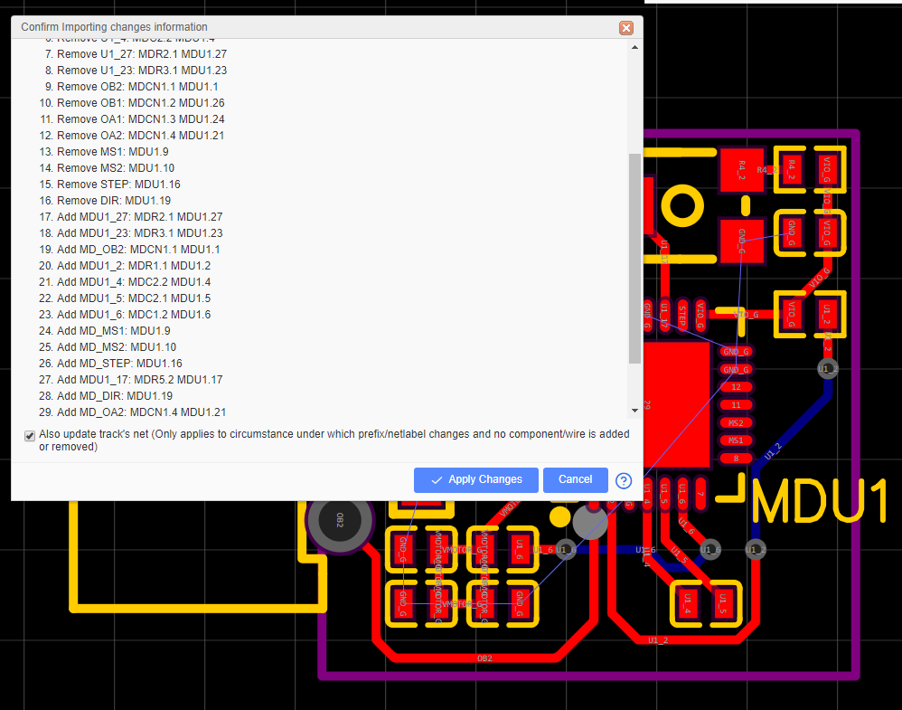

**AND YOU ARE DONE! REPEAT FOR MORE INSTANCES! 🎉🎉🎉**

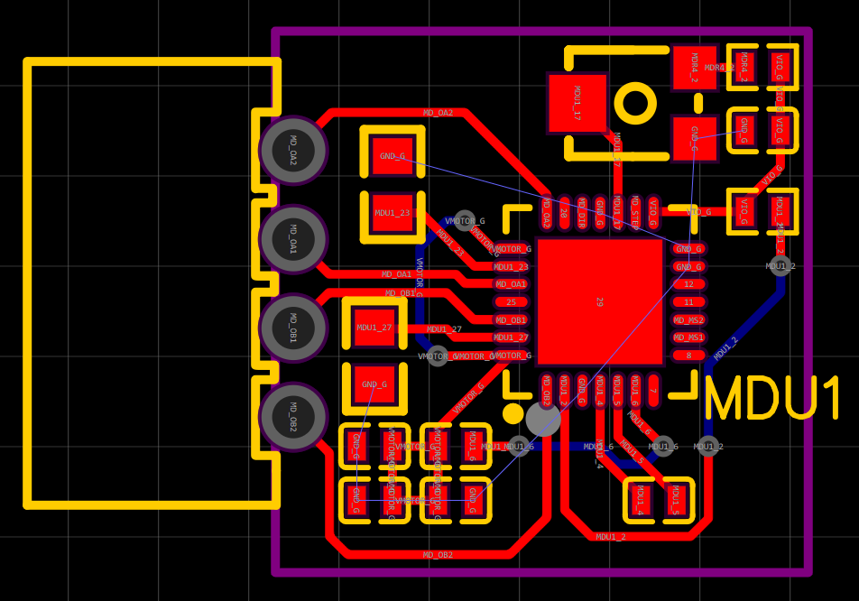

## 3 Replace Net Names
- Remove the `_G` prefixes using the `Replace Net Names` tool.
- Change labels like `VIO` or `VMOTOT` to `3V3` and `12V`

## 4 Replace Tracks and Via Names
Currently no use, but feature is implemented anyways.